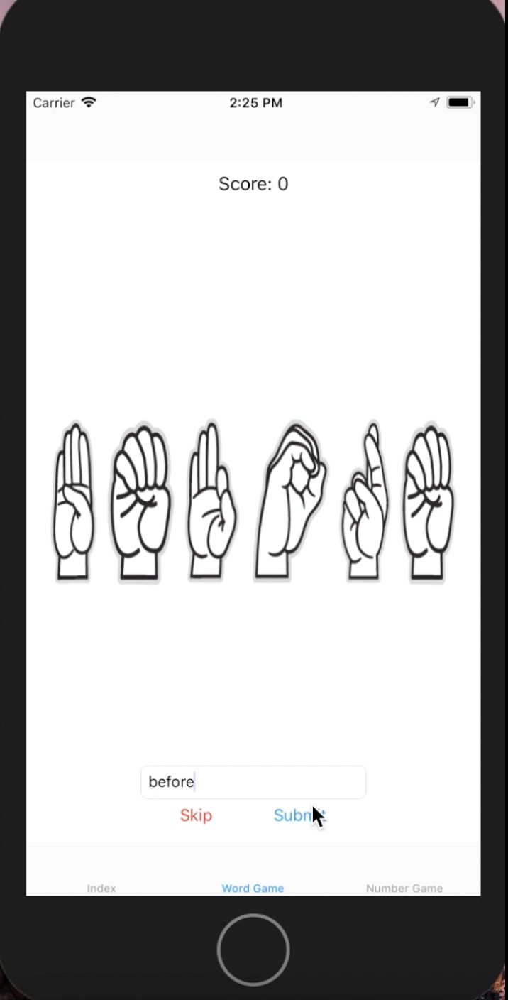

# ASL-Alphabet-Game
Video: https://youtu.be/TwXDmUJyx5Y

# Description
I wanted to make this project so I could test myself on what I've learned from Hacking with Swift, it was extremely fun to make and I'm excited to put more features in the future. DISCLAIMER: I know this is not how American Sign Language is supposed to be communicated. The alphabet is used mostly for names and most of the words I have in the game have an actual sign for them.

*WHAT IT HAS :* 
There are 3 tabs: Index, Word Game and Number Game. The first tab shows the image of the ASL Alphabet/Number alongside the letter or number it represents. The second tab has a game in which a word is spelled out using the ASL alphabet and the user must try to figure out what the word is. They can enter their answer and if it's correct they increase their score by 1. If it is incorrect they have an infinite amount of chances to figure out the word. Users also have the option of skipping the word which will result in a decreased score. The third tab has the something similar such that the user must figure out what number is being shown.

*SPECIFICS :* 
The first tab is a tableview with custom cells where there is a label and an image view. The images are taken from the link: https://shop.cricut.com/en_us/cartridges-images/fonts/american-sign-language-alphabet-digital-set.html. I just cut the individual letters using photoshop. I loaded all the images into a dictionary using the letter or number as the key. I also used a list of the most common words in english from this link: https://github.com/first20hours/google-10000-english/blob/master/google-10000-english-no-swears.txt. I used the Gameplay Kit to randomize the words in the array that I put it in and then kept an index so that I wouldn't need to shuffle the array every time I wanted to get a new word. For the number game I also used the Gameplay kit but for a number up to 9999.

*ISSUES :*
Autolayout will be the death of me. Stack views are the answer!
